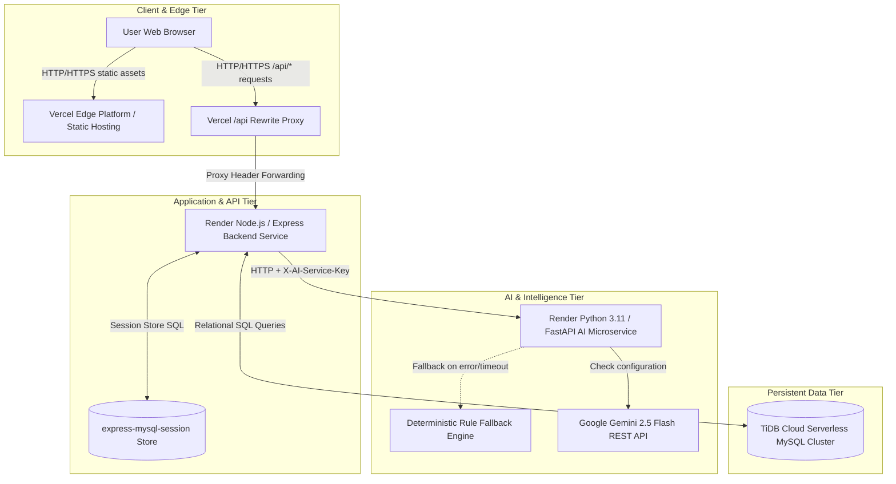
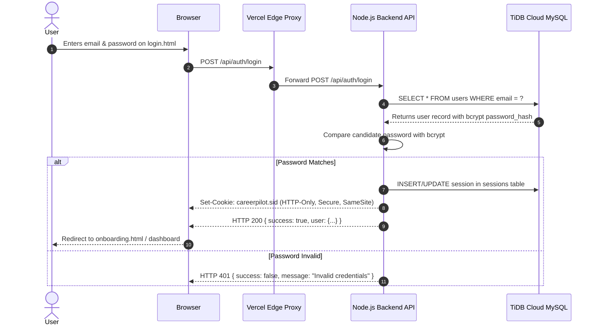
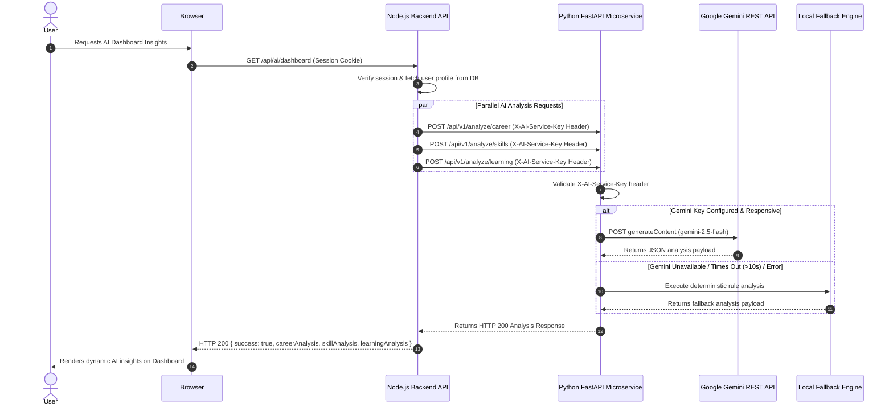

# CareerPilot AI — System Architecture Documentation

This document describes the production architecture, request execution flows, database relationships, AI microservice design, security model, and cloud deployment topology of CareerPilot AI.

---

## 1. System Architecture Overview

CareerPilot AI is architected as a decoupled, multi-tier cloud application using native cloud services (No Docker required).



---

## 2. Request & Execution Flows

### 2.1 User Authentication & Session Flow



---

### 2.2 Server-to-Server AI Intelligence Analysis Flow



---

## 3. Database Architecture & ER Diagram

The persistent database tier runs on **TiDB Cloud** (MySQL 8.0 protocol compatible).

```mermaid
erDiagram
    users {
        BIGINT id PK
        VARCHAR full_name
        VARCHAR email UK
        VARCHAR password_hash
        VARCHAR status
        TIMESTAMP created_at
    }

    profiles {
        BIGINT user_id PK, FK
        VARCHAR location
        VARCHAR college
        VARCHAR degree
        VARCHAR branch
        VARCHAR current_year
        SMALLINT graduation_year
        VARCHAR target_career
        VARCHAR experience_level
        TEXT career_goal
        BOOLEAN completed
    }

    profile_skills {
        BIGINT id PK
        BIGINT user_id FK
        VARCHAR skill_name
    }

    profile_interests {
        BIGINT id PK
        BIGINT user_id FK
        VARCHAR interest_name
    }

    assessment_reports {
        BIGINT id PK
        BIGINT user_id FK
        VARCHAR career_direction
        TEXT profile_summary
        JSON strengths
        JSON current_skills
        JSON focus_areas
        TEXT career_advice
    }

    readiness_reports {
        BIGINT id PK
        BIGINT user_id FK
        VARCHAR target_career
        TINYINT score
        VARCHAR status
        JSON met_skills
        JSON missing_skills
        JSON skill_gaps
    }

    roadmap_instances {
        BIGINT id PK
        BIGINT user_id FK
        VARCHAR target_career
        TINYINT readiness_score
        INT total_items
        INT completed_items
    }

    roadmap_items {
        BIGINT id PK
        BIGINT roadmap_id FK
        VARCHAR skill
        VARCHAR stage
        VARCHAR priority
        VARCHAR status
        INT item_order
    }

    project_catalog {
        BIGINT id PK
        VARCHAR project_key UK
        VARCHAR target_career
        VARCHAR title
        VARCHAR difficulty
        JSON required_skills
    }

    user_projects {
        BIGINT id PK
        BIGINT user_id FK
        BIGINT project_id FK
        VARCHAR status
        TIMESTAMP started_at
        TIMESTAMP completed_at
    }

    interview_questions {
        BIGINT id PK
        VARCHAR question_key UK
        VARCHAR target_career
        VARCHAR category
        TEXT question_text
    }

    interview_sessions {
        BIGINT id PK
        BIGINT user_id FK
        VARCHAR mode
        VARCHAR target_career
        DECIMAL technical_score
        DECIMAL communication_score
        DECIMAL problem_solving_score
        DECIMAL overall_score
    }

    interview_responses {
        BIGINT id PK
        BIGINT session_id FK
        BIGINT question_id FK
        TEXT response_text
        DECIMAL technical_score
        DECIMAL communication_score
        DECIMAL problem_solving_score
    }

    portfolio_evidence {
        BIGINT id PK
        BIGINT user_id FK
        VARCHAR project_title
        VARCHAR github_repo_url
        VARCHAR live_demo_url
        TEXT tech_stack
    }

    sessions {
        VARCHAR session_id PK
        INT expires
        MEDIUMTEXT data
    }

    users ||--o| profiles : "has"
    users ||--o{ profile_skills : "possesses"
    users ||--o{ profile_interests : "has"
    users ||--o{ assessment_reports : "generates"
    users ||--o{ readiness_reports : "calculates"
    users ||--o{ roadmap_instances : "tracks"
    users ||--o{ user_projects : "undertakes"
    users ||--o{ interview_sessions : "practices"
    users ||--o{ portfolio_evidence : "submits"
    roadmap_instances ||--o{ roadmap_items : "contains"
    project_catalog ||--o{ user_projects : "cataloged_in"
    interview_sessions ||--o{ interview_responses : "evaluates"
    interview_questions ||--o{ interview_responses : "answers"
```



---

## 4. Security Architecture

### 4.1 Secret Isolation Model
- **Client (Browser)**: Zero API keys, database credentials, or secret tokens are embedded in frontend files.
- **Vercel Proxy**: Acts as an edge gateway forwarding `/api/*` calls to Render.
- **Express Backend**: Holds `TIDB_*` database credentials, `SESSION_SECRET`, `AI_SERVICE_URL`, and `AI_SERVICE_SECRET`.
- **FastAPI Microservice**: Holds `AI_SERVICE_SECRET` and `GEMINI_API_KEY`.

### 4.2 Authentication & Protection Measures
- **HTTP-Only Cookies**: `careerpilot.sid` cookie cannot be accessed via JavaScript (`document.cookie`), neutralizing Cross-Site Scripting (XSS) session theft.
- **SameSite Cookie Policy**: Prevents Cross-Site Request Forgery (CSRF).
- **Password Hashing**: `bcrypt` algorithm with 10 salt rounds used for storing user passwords.
- **Rate Limiting**: `express-rate-limit` enforces max 30 auth requests per 15 minutes to block brute-force attempts.
- **Server-to-Server Authentication**: FastAPI requires an exact match for the `X-AI-Service-Key` header; external direct requests are rejected with `HTTP 401 Unauthorized`.

---

## 5. Deployment Topology

```mermaid
flowchart TD
    subgraph Edge ["Vercel Global Edge Network"]
        VercelWeb[Static Frontend Site]
        VercelRewrite[Rewrite Proxy: /api/*]
    end

    subgraph RenderOregon ["Render Cloud Region (Oregon)"]
        NodeService[Render Native Node Web Service]
        AIService[Render Native Python FastAPI Microservice]
    end

    subgraph DataCloud ["TiDB Cloud & External AI"]
        TiDBCluster[(TiDB Serverless Cluster)]
        GeminiAPI[Google Gemini REST API]
    end

    VercelWeb -->|Client Interaction| VercelRewrite
    VercelRewrite -->|HTTPS Proxy| NodeService
    NodeService -->|MySQL Connection Pool (Port 4000 + SSL)| TiDBCluster
    NodeService -->|HTTP + X-AI-Service-Key| AIService
    AIService -->|HTTPS generateContent| GeminiAPI
```

---

## 6. Verification Status

All architectural layers, database schema definitions, AI fallback routines, security headers, and deployment proxy rules documented above have been verified against the current repository source code and live staging/production deployment manifests.
