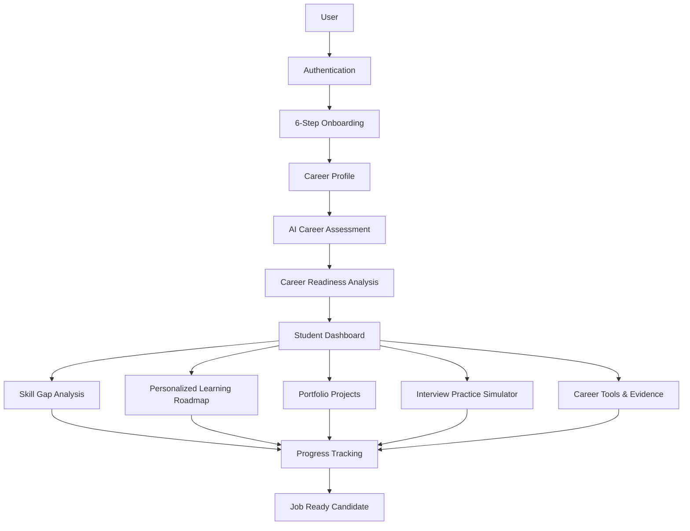
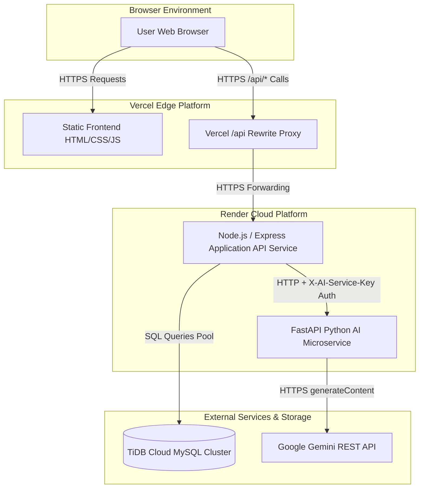
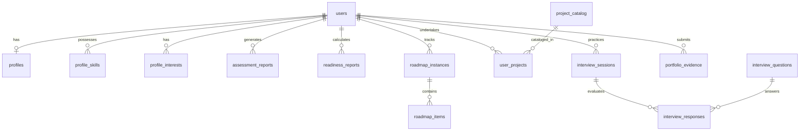
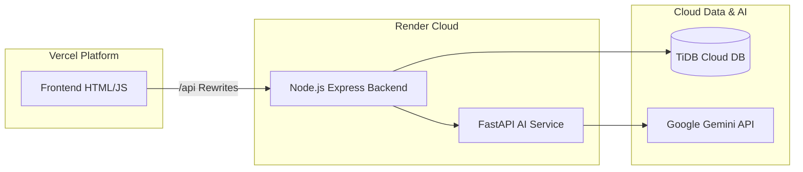

# CareerPilot AI — AI-Powered Career Guidance Platform

CareerPilot AI is a production-ready, full-stack career guidance platform designed for students and freshers. It helps candidates determine career direction, measure current job readiness, discover skill gaps, follow personalized learning roadmaps, build portfolio projects, practice technical interviews, and generate career evidence passports to achieve job readiness.

---

## 🎯 What is CareerPilot AI?

CareerPilot AI provides an end-to-end intelligent career development suite comprising:

- **Career Direction & Assessment**: Evaluates student background, degree, skills, and goals to recommend aligned tech career paths.
- **Quantitative Career Readiness**: Calculates a deterministic, weighted Job Readiness Score (0–100%) against industry requirements for 12 career domains.
- **Skill Gap Analysis**: Identifies missing, developing, and met skills with prioritized actionable recommendations.
- **Personalized Learning Roadmap**: Generates a structured 5-stage learning path with prerequisite dependency graph mapping.
- **Portfolio Projects & Tracker**: Recommends domain-specific portfolio projects matching skill gaps and tracks execution progress.
- **Interactive Interview Simulator**: Simulates STAR-method technical interviews with multi-dimensional scoring across Technical Depth, Communication, and Problem-Solving.
- **Career Tools & Verified Evidence Passport**: Aggregates candidate proof of work (GitHub repositories and live deployment URLs) into a shareable candidate passport.
- **AI Intelligence Integration**: Combines server-side Google Gemini LLM analysis with deterministic fallback engines.

---

## 🔄 Product Flow



---

## 🏗️ Technical Architecture Flowchart



### Key Architectural Constraints & Enforcement:
1. **Zero Direct Browser AI Calls**: The user's browser never directly calls the FastAPI microservice or Google Gemini API.
2. **Node.js API Layer**: The Express backend acts as the single entry-point application API, handling authentication, session validation, route guards, and business logic.
3. **Isolated Secrets**: Database credentials, `SESSION_SECRET`, `GEMINI_API_KEY`, and `AI_SERVICE_SECRET` reside strictly on server-side environment configurations.
4. **Persistent Data Tier**: TiDB Cloud MySQL provides persistent storage for users, profiles, assessments, roadmaps, projects, interviews, and session states.
5. **Separated AI Microservice**: The Python/FastAPI service handles AI payload validation, prompt engineering, Gemini API communication, and fallback engine logic independently.

---

## 📊 Development Progress

| Phase | Feature | Status | Implemented Functionality & Important Files | Primary Git Commit(s) | Test Status |
| :--- | :--- | :--- | :--- | :--- | :--- |
| **Phase 1** | Authentication | ✅ Complete | User registration, login, logout, session management, horror UI design system (`auth.js`, `login.html`, `register.html`, `auth.routes.js`) | [`06f4b8d`](https://github.com/anshbhatnagara-gif/CareerPilotAI/commit/06f4b8d), [`999e15f`](https://github.com/anshbhatnagara-gif/CareerPilotAI/commit/999e15f) | Verified (`test-auth.js`) |
| **Phase 2** | Onboarding & Profile | ✅ Complete | 6-Step interactive onboarding builder, personal details, education, skills, interests, career goal (`onboarding.js`, `onboarding.html`, `profile.routes.js`) | [`23c27ea`](https://github.com/anshbhatnagara-gif/CareerPilotAI/commit/23c27ea), [`5999b8e`](https://github.com/anshbhatnagara-gif/CareerPilotAI/commit/5999b8e) | Verified (`test-profile.js`) |
| **Phase 3** | AI Career Assessment | ✅ Complete | Qualitative profile alignment assessment, strengths, focus areas, career guidance (`assessment.js`, `assessment.html`, `assessment.routes.js`) | [`5630508`](https://github.com/anshbhatnagara-gif/CareerPilotAI/commit/5630508), [`eae361d`](https://github.com/anshbhatnagara-gif/CareerPilotAI/commit/eae361d) | Verified (`test-assessment.js`) |
| **Phase 4** | Career Readiness & Skill Gap | ✅ Complete | Quantitative 0–100 weighted readiness scoring, requirement matrix, skill gap categorization (`readiness.js`, `readiness.html`, `readiness.routes.js`) | [`4ce0b4d`](https://github.com/anshbhatnagara-gif/CareerPilotAI/commit/4ce0b4d), [`eae361d`](https://github.com/anshbhatnagara-gif/CareerPilotAI/commit/eae361d) | Verified (`test-readiness.js`) |
| **Phase 5** | Personalized Roadmap | ✅ Complete | 5-Stage personalized learning path generator, prerequisite graph, effort estimation (`roadmap.js`, `roadmap.html`, `roadmap.routes.js`) | [`98d5108`](https://github.com/anshbhatnagara-gif/CareerPilotAI/commit/98d5108), [`ed799f9`](https://github.com/anshbhatnagara-gif/CareerPilotAI/commit/ed799f9) | Verified (`test-roadmap.js`) |
| **Phase 6** | Projects & Project Tracker | ✅ Complete | Domain project catalog, gap matching, project status workflow tracking (`projects.js`, `projects.html`, `projects.routes.js`) | [`d60d9a3`](https://github.com/anshbhatnagara-gif/CareerPilotAI/commit/d60d9a3), [`ed799f9`](https://github.com/anshbhatnagara-gif/CareerPilotAI/commit/ed799f9) | Verified (`test-projects.js`) |
| **Phase 7** | Interview Simulator & Career Tools | ✅ Complete | STAR method technical interview simulator, multi-dimensional scoring, ATS resume preview, evidence tracker (`interview.js`, `interview.html`, `interview.routes.js`) | [`d4cc867`](https://github.com/anshbhatnagara-gif/CareerPilotAI/commit/d4cc867), [`a1ac8b4`](https://github.com/anshbhatnagara-gif/CareerPilotAI/commit/a1ac8b4) | Verified (`test-interview.js`, `test-career-tools.js`) |
| **Phase 8** | Backend, Database & AI Microservice | ✅ Complete | Express API layer, TiDB Cloud MySQL migrations, persistent session store, Python FastAPI microservice, Gemini AI integration & fallback (`backend/src`, `ai-service/app`, `migrations`) | [`6ae67d2`](https://github.com/anshbhatnagara-gif/CareerPilotAI/commit/6ae67d2), [`9ffca3d`](https://github.com/anshbhatnagara-gif/CareerPilotAI/commit/9ffca3d), [`87cd520`](https://github.com/anshbhatnagara-gif/CareerPilotAI/commit/87cd520), [`7540eb4`](https://github.com/anshbhatnagara-gif/CareerPilotAI/commit/7540eb4) | Verified (Full backend test suite & `test-ai-dashboard.js`) |
| **Phase 9** | Cloud Infrastructure & Production Deployment | ✅ Complete | Vercel rewrite configuration, Render Node web service, Render FastAPI web service, TiDB Cloud staging/prod integration, GitHub Actions CI (`vercel.json`, `render.yaml`, `.github/workflows`) | [`39562c6`](https://github.com/anshbhatnagara-gif/CareerPilotAI/commit/39562c6), [`48505f2`](https://github.com/anshbhatnagara-gif/CareerPilotAI/commit/48505f2), [`84e3dff`](https://github.com/anshbhatnagara-gif/CareerPilotAI/commit/84e3dff) | Verified (Live Cloud Verification) |

---

## 🌐 Current Production Status

- **GitHub Repository**: [https://github.com/anshbhatnagara-gif/CareerPilotAI](https://github.com/anshbhatnagara-gif/CareerPilotAI)
- **Production Frontend (Vercel)**: [https://career-pilot-ai-vert-six.vercel.app/](https://career-pilot-ai-vert-six.vercel.app/)
- **Registration Page**: [https://career-pilot-ai-vert-six.vercel.app/register.html](https://career-pilot-ai-vert-six.vercel.app/register.html)
- **Login Page**: [https://career-pilot-ai-vert-six.vercel.app/login.html](https://career-pilot-ai-vert-six.vercel.app/login.html)
- **Production Backend API (Render)**: [https://careerpilotai-ly8b.onrender.com](https://careerpilotai-ly8b.onrender.com)
- **Backend Health Check**: [https://careerpilotai-ly8b.onrender.com/api/health](https://careerpilotai-ly8b.onrender.com/api/health)
- **FastAPI AI Microservice (Render)**: `careerpilot-ai-service` (Internal Render Host communication; direct public URL *Not verified in repository*)
- **Database Engine**: TiDB Cloud Serverless MySQL Cluster (`careerpilot`)
- **CI/CD Pipeline**: GitHub Actions (`.github/workflows/ci.yml` and `deploy.yml`)
- **Current Operational Health**: Healthy (All primary user flows operational over HTTPS)
- **Known Limitations**: Render free-tier services spin down after inactivity, causing a short initial cold-start delay on first request.

---

## 🗄️ Database Architecture

CareerPilot AI utilizes **TiDB Cloud** (MySQL 8.0 compatible) with **15 verified tables**:



### Table Definitions & Purpose:
1. `users`: Core user authentication credentials (full name, email, bcrypt password hash, account status, login timestamps).
2. `profiles`: Candidate profile details (college, branch, degree, current year, graduation year, target career, experience level, goal).
3. `profile_skills`: Normalised candidate skills list linked to `users.id`.
4. `profile_interests`: Candidate interest areas linked to `users.id`.
5. `assessment_reports`: Qualitative AI career direction, profile summary, strengths, focus areas, advice.
6. `readiness_reports`: Quantitative 0–100 job readiness scores, met/missing skill vectors, priority gap breakdowns.
7. `roadmap_instances`: Personalized learning roadmap instances, completion counters, total estimated effort.
8. `roadmap_items`: Stage-by-stage learning roadmap items, prerequisites, skill requirements, execution status (`UPCOMING`, `IN_PROGRESS`, `COMPLETED`).
9. `project_catalog`: Master portfolio project repository across 12 tech career domains, difficulty levels, milestones.
10. `user_projects`: Junction table tracking user project adoption, progress status (`NOT_STARTED`, `IN_PROGRESS`, `COMPLETED`), start and completion timestamps.
11. `interview_questions`: Domain-specific technical question bank, categories, expected key concepts.
12. `interview_sessions`: Candidate interview session records, mode (QUICK, STANDARD, DEEP), multi-dimensional score aggregates.
13. `interview_responses`: Detailed candidate responses per question, STAR breakdown, technical/communication/problem-solving score vector.
14. `portfolio_evidence`: Candidate proof of work links (GitHub repository URL, live deployment URL, tech stack, proof status).
15. `sessions`: Server-side persistent session storage table for Express `express-mysql-session`.

---

## ⚡ Backend API Reference

### Health & Monitoring
- `GET /api/health`: Public system health status.
- `GET /api/health/db`: TiDB Cloud database connection health check.
- `GET /api/health/ai`: FastAPI AI microservice connectivity health check.

### Authentication (`/api/auth`)
- `POST /api/auth/register`: Public (Rate-limited). Creates a new user account with hashed password.
- `POST /api/auth/login`: Public (Rate-limited). Authenticates credentials and issues an HTTP-Only session cookie.
- `POST /api/auth/logout`: Auth Required. Destroys active server session and clears cookie.
- `GET /api/auth/me`: Auth Required. Returns currently authenticated user context.
- `GET /api/auth/protected-test`: Auth Required. Route protection sanity test.

### Career Profile (`/api/profile`)
- `GET /api/profile`: Auth Required. Retrieves full profile, skills, and interests.
- `PUT /api/profile`: Auth Required. Validates and saves profile updates.

### Assessment & Readiness (`/api/assessment`, `/api/readiness`)
- `GET /api/assessment`: Auth Required. Generates/fetches qualitative career assessment report.
- `GET /api/readiness`: Auth Required. Calculates 0–100 weighted readiness score and skill gap breakdown.

### Learning Roadmap (`/api/roadmap`)
- `GET /api/roadmap`: Auth Required. Returns personalized 5-stage learning roadmap.

### Projects (`/api/projects`)
- `GET /api/projects`: Auth Required. Retrieves domain-matched portfolio projects and user progress.
- `PATCH /api/projects/:id`: Auth Required. Updates project status (`NOT_STARTED`, `IN_PROGRESS`, `COMPLETED`).

### Interview Practice (`/api/interview`)
- `GET /api/interview/questions`: Auth Required. Fetches questions for requested session mode (QUICK: 5, STANDARD: 10, DEEP: 15).
- `POST /api/interview/evaluate`: Auth Required. Evaluates session answers and records multi-dimensional scores.
- `GET /api/interview/history`: Auth Required. Retrieves past interview session performance history.

### Career Tools (`/api/career-tools`)
- `GET /api/career-tools/evidence`: Auth Required. Fetches user portfolio proof links.
- `POST /api/career-tools/evidence`: Auth Required. Saves/updates candidate GitHub repo and live deployment URLs.
- `GET /api/career-tools/passport`: Auth Required. Dynamically compiles full candidate Career Evidence Passport.

### AI Intelligence (`/api/ai`)
- `GET /api/ai/dashboard`: Auth Required. Executes parallel AI analysis calls for career, skills, and learning insights.
- `POST /api/ai/career`: Auth Required. Direct career path AI analysis.
- `POST /api/ai/skills`: Auth Required. Direct skill gap AI analysis.
- `POST /api/ai/learning`: Auth Required. Direct learning roadmap AI recommendation.

---

## 🤖 AI Architecture

CareerPilot AI operates a dedicated **Python 3.11 / FastAPI** microservice backed by **Google Gemini REST API (`gemini-2.5-flash`)**.

- **Model Provider**: Google Gemini API (`v1beta/models/gemini-2.5-flash:generateContent`).
- **Communication Protocol**: Server-to-server HTTP requests from Express Node backend to FastAPI microservice using header authentication (`X-AI-Service-Key`).
- **Resilience & Fallback Engine**: If Gemini is unconfigured, rate-limited, or times out (>10,000ms), the microservice automatically routes payload execution to a deterministic local rule engine (`fallback_engine.py`).
- **AI Endpoints**:
  - `POST /api/v1/analyze/career` (Server Auth)
  - `POST /api/v1/analyze/skills` (Server Auth)
  - `POST /api/v1/analyze/learning` (Server Auth)
  - `GET /health` (Public)
  - `GET /health/dependencies` (Public)

*Note: CareerPilot AI utilizes an external LLM provider with fallback intelligence; it does not claim to run a custom-trained or fine-tuned model.*

---

## 🔒 Security Architecture

- **Session Security**: Express HTTP-Only cookies (`careerpilot.sid`) with `SameSite=Lax`/`None` and `SECURE_COOKIE=true` on production HTTPS.
- **Password Protection**: Passwords stored using `bcrypt` password hashing with 10 salt rounds.
- **Rate Limiting**: `express-rate-limit` enforces max 30 auth requests per 15 minutes to prevent brute-force attacks.
- **Header Authentication**: Node to FastAPI AI communication protected via server-to-server `X-AI-Service-Key` verification.
- **Zero Secrets Leakage**: No API keys, database passwords, or session secrets are embedded in frontend code.
- **Cross-Origin Enforcement**: Backend strictly restricts CORS headers to authorized frontend origins.

---

## 🧪 Testing Infrastructure

The repository maintains automated test suites across all tiers:

- **CI Pipeline (`.github/workflows/ci.yml`)**:
  - Security audit for untracked `.env` files.
  - Strict No-Docker compliance verification (enforcing native cloud runtimes).
  - Static JavaScript syntax validation across all frontend scripts.
  - Python Pytest suite for FastAPI AI microservice (`pytest` in `ai-service/tests`).
  - Node.js backend unit & integration tests (`npm run test:auth`, `test:profile`, `test:assessment`, `test:readiness`, `test:roadmap`, `test:projects`, `test:interview`, `test:career-tools`, `test:ai`).
  - End-to-end integration test suite (`test-ai-dashboard.js`, `frontend-auth-test.js`, etc.).

---

## 🚀 Deployment Architecture

- **Frontend**: Vercel Static Hosting with `/api/*` rewrites.
- **Backend API**: Render Native Node.js Web Service.
- **AI Microservice**: Render Native Python Web Service.
- **Database**: TiDB Cloud Serverless MySQL Cluster.
- **CI/CD**: GitHub Actions workflows.

*Note: Containerization engines such as Docker are explicitly NOT required for this deployment architecture.*



---

## 🚀 GitHub Actions Workflows

Found under `.github/workflows/`:

1. **`ci.yml`**: Runs automatically on every push or pull request to `main`.
   - Validates repository security and absence of committed secrets.
   - Enforces native cloud runtime policy (No Docker).
   - Audits frontend JS syntax.
   - Executes Python Pytest suite (Python 3.11).
   - Executes Node.js backend & E2E integration test suites (Node 20.x).
2. **`deploy.yml`**: Dispatchable workflow for verifying production environment readiness and release triggers.

---

## 🔮 Future Development Roadmap

### Phase 10 — Production Hardening (Planned)
- Advanced IP rate limiting & Web Application Firewall rules.
- Production Sentry/Datadog error tracking and observability.
- Automated database backup & point-in-time recovery verification.

### Phase 11 — AI Intelligence Expansion (Planned)
- Direct LLM STAR response analysis with audio speech-to-text transcript processing.
- Vector embedding matching for job description to skill gap alignment.
- Personalized AI mentor chat agent.

### Phase 12 — Student Experience (Planned)
- Interactive learning milestone analytics dashboard.
- Achievement badges & streak motivation system.
- Email digest notifications for roadmap step deadlines.

### Phase 13 — Career Ecosystem (Planned)
- Automated ATS resume parser and gap optimizer.
- Match engine for active internship and entry-level job postings.
- Recruiter share links for verified Career Evidence Passports.

### Phase 14 — Scaling & Performance (Planned)
- Redis cache layer for AI responses and static project catalogs.
- Background worker queues (BullMQ/Celery) for heavy batch calculations.
- Multi-region database replication and CDN edge response optimization.

---

## 📁 Project Structure

```text
careerpilot-ai/
├── .github/
│   └── workflows/
│       ├── ci.yml                 # GitHub Actions Continuous Integration pipeline
│       └── deploy.yml             # GitHub Actions Deployment preparation workflow
├── ai-service/
│   ├── app/
│   │   ├── api/routes/            # FastAPI router endpoints (analyze, health)
│   │   ├── config/                # Environment configuration settings
│   │   ├── core/                  # Structured logging and utilities
│   │   ├── providers/             # Gemini API REST client implementation
│   │   ├── schemas/               # Pydantic request/response data models
│   │   ├── services/              # AI service dispatcher & deterministic fallback engine
│   │   └── main.py                # FastAPI microservice entrypoint
│   ├── tests/                     # Pytest suite for AI microservice
│   ├── README.md                  # Microservice architecture documentation
│   └── requirements.txt           # Python dependencies
├── assets/                        # Design assets and background graphics
├── backend/
│   ├── migrations/                # TiDB Cloud SQL migrations (001_initial, 002_sessions)
│   ├── scripts/                   # Migration, seeding, and unit/integration test scripts
│   ├── src/
│   │   ├── config/                # Database pool & environment initialization
│   │   ├── controllers/           # API request handlers
│   │   ├── middleware/           # Session authentication & route protection
│   │   ├── routes/                # Express router endpoints
│   │   ├── services/              # Business logic & AI client integration
│   │   ├── app.js                 # Express application middleware assembly
│   │   └── server.js              # Server HTTP listener initialization
│   ├── package.json               # Node.js backend dependencies and test scripts
│   └── README.md                  # Backend service documentation
├── assessment.html / .js          # Career Assessment view & script
├── auth-success.html / auth.js    # Auth success callback & client session script
├── index.html                     # Project landing page
├── interview.html / .js           # Interview Simulator & Resume tools view & script
├── login.html                     # Account Login page
├── onboarding.html / .js          # 6-Step Career Profile Onboarding view & script
├── projects.html / .js            # Portfolio Projects & Tracker view & script
├── readiness.html / .js           # Job Readiness & Skill Gap view & script
├── register.html                  # Account Registration page
├── render.yaml                    # Native Cloud deployment manifest for Render
├── roadmap.html / .js             # Personalized Learning Roadmap view & script
├── style.css                      # Cinematic Dark UI Design System
├── vercel.json                    # Vercel proxy rewrite configuration
├── ARCHITECTURE.md                # System Architecture Documentation
├── CHANGELOG.md                   # Project History & Commit Ledger
├── DEPLOYMENT.md                  # Production Cloud Deployment Guide
├── ROADMAP.md                     # Completed vs Planned Feature Roadmap
└── README.md                      # Primary Project Documentation
```

---

## 🔗 Documentation Links

- [ARCHITECTURE.md](file:///c:/career%20pilot%20ai%202.0/careerpilot-ai/ARCHITECTURE.md) — Comprehensive System Architecture & Data Flow Diagrams
- [ROADMAP.md](file:///c:/career%20pilot%20ai%202.0/careerpilot-ai/ROADMAP.md) — Project Roadmap & Stage Tracking
- [CHANGELOG.md](file:///c:/career%20pilot%20ai%202.0/careerpilot-ai/CHANGELOG.md) — Full Commit History & Phase Evolution Ledger
- [DEPLOYMENT.md](file:///c:/career%20pilot%20ai%202.0/careerpilot-ai/DEPLOYMENT.md) — Native Cloud Deployment Guide
